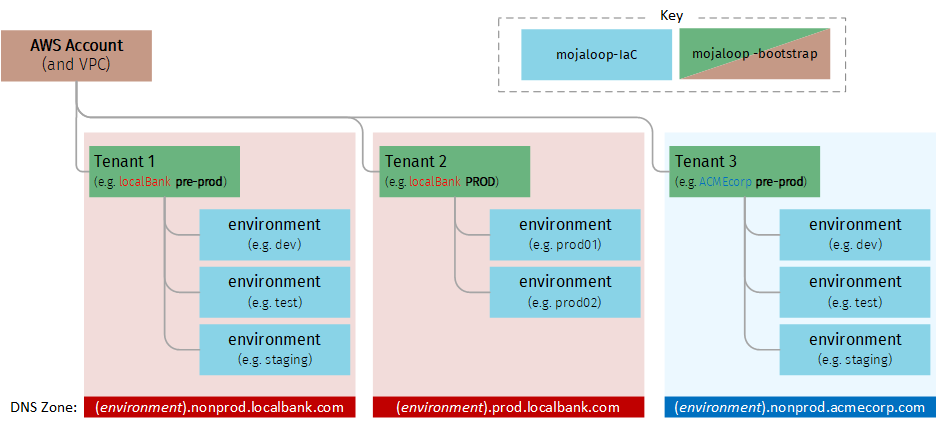

# Mojaloop Platform Bootstrap

The intention of this repository is to create the execution environment (also known as "Tenancy" throughout this document) for a single, or multiple mojaloop environments. The objective is to collect multiple environments together to simplify billing, access controls and MAD (Monitoring, Audit and Deployment) processes.

A typical deployment structure might be as follows:

Note that 'bootstrap' - "tenant" typically corresponds to an AWS account and a VPC, and defines the underlying network subnets for each environment.

Environments share services in a tenant, such as management resources (wireguard vpn, secrets management, monitoring and eventlogging) as well as AWS resources such as VPC, IAM and internet egress NAT gateway.
Environments can, however, have differing root DNS entries.

## How to use bootstrap

To deploy the first mojaloop environment for a new tenant must first be created. This repository will do that.

* [Building a tenancy](./documents/d100.building.md) should be followed to complete the initial setup before attempting to deploy a mojaloop environment.

* Once these are completed, proceed to the latest release of [IaC Platform](https://github.com/mojaloop/iac-aws-platform/releases/) And follow the README.md file to deploy it.

## What is a 'bootstrap'?

The term "booting" a computer refers to a much older phrase from the mainframe era - "bootstrapping" the system referred to the first place the system would always look to execute the first bytes of code that would start loading the rest of the operating system.  Literally: _"pulling the system up by it's boot-straps"_

For some light reading, see: [Wikipedia - bootstrapping](https://en.wikipedia.org/wiki/Bootstrapping)
