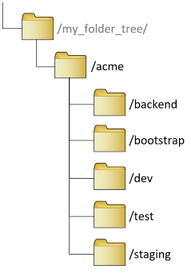

# Building a Tenancy

This document details the steps that must be followed by an engineer to to create a tenancy, prior to deploying a mojaloop environment.

Whilst deployment (and re-deployment) of mojaloop environments is a highly automated process, at present this relies on the creation of a Tenancy - essentially a ‘company entity’ in AWS for hosting mojaloop, which contains the source-repository for each environment deployed within that tenancy.

This approach ensures that environments benefit fully from repeatable deployment - allowing multiple instances to be quickly created, re-created and destroyed in parallel without impacting each other, but consistent with each other.

## Caveats

At present, a Tenancy is designed to operate within a single AWS region.   Whilst a tenancy or an environment can be built to span multiple AWS regions, this level of deployment is currently out-of-scope of this document.

## Pre-requisites

This guide has been tested with the following software installed on the users workstation:

- aws-cli v2
- terraform v0.13.5   -  _note:  using any other version of Terraform will result in statefile incompatibilities and is o be avoided._
- git version 2.17.1
- ansible 2.9.7

This guide assumes a *nix command line (eg. BASH) is being used for deployment.

## Preparation

Collect the data from the Mojaloop Platform request form. In this scenario it provides the following data

|  Company name:                   |  Domain name:                      |  Names of Envs needed:           |
|----------------------------------|------------------------------------|----------------------------------|
|   ACME Company                   |  acme.com                          |  dev                             |
|                                  |                                    |  test                            |
|                                  |                                    |  prod                            |

This document assumes an AWS Account has already been created for this customer, and that you are familiar with logging in with your IAM user account, both to the console and AWS CLI.

## Creating a customer Tenancy

Environments are designed to be deployed within an Tenancy. This method provides reliable automation of environmental upgrades, development, testing, rollback, etc, etc.

A completed Tenancy will result in a local filesystem consisting of a backend folder, a bootstrap folder, and folders git-cloned for each deployed environment repository - see the illustration.

## Step-by-Step Walkthrough

1. [IAM User Permissions](./d101.IAM-prep.md)
2. [Create an AWS Hosted DNS Zone (route53)](./d102.DNS-zone.md)
3. [Create a Local Workspace](./d103.local-workspace.md)
4. [Clone the AWS-backend repo](./d104.backend-repo.md)
5. [Setting up AWS credentials](./d105.aws-credentials.md)
6. [Initialise the Terraform backend](./d106.init-backend.md)
7. [Create the Terraform remote-state file](./d107.tf-state.md)
8. [Create the bootstrap](./d108.create-bootstrap.md)
9. [Initialise bootstrap terraform](./d109.init-bootstrap.md)
10. [Plan the bootstrap deployment](./d110.deploy-bootstrap.md)
11. [Creating the bootstrap](./d111.create-bootstrap.md)
12. [Creating a Wireguard connection](./d20.wireguard_setup.md)
13. [Configuraing the GitLab CI-Runner AWS account](./d113.ci-runner-creds.md)
14. [Configuring Authentication)](./d114.config-auth.md)
15. [Setup Gitlab](./d115.setup-gitlab.md)
16. [Check the CI_Runner](./d116.ci-runner-check.md)
17. [Push Bootstrap to GitLab](./d117.push-bootstrap.md)

- Once these are completed, proceed to the latest release of [mojaloop-platform-iac](https://github.com/mojaloop/iac-aws-platform/releases/) And follow the README.md file to deploy it.
