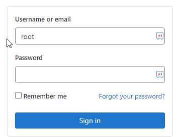
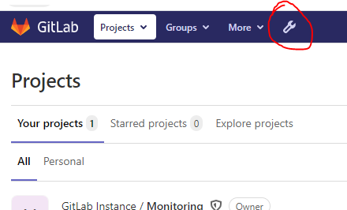
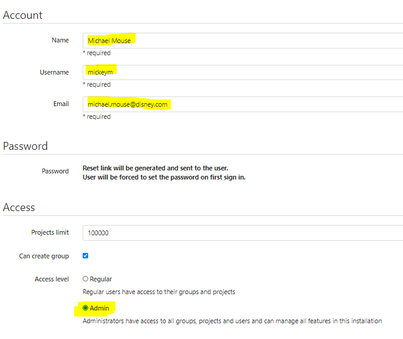
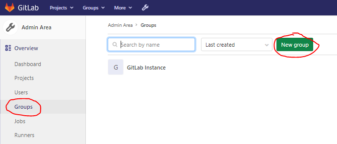
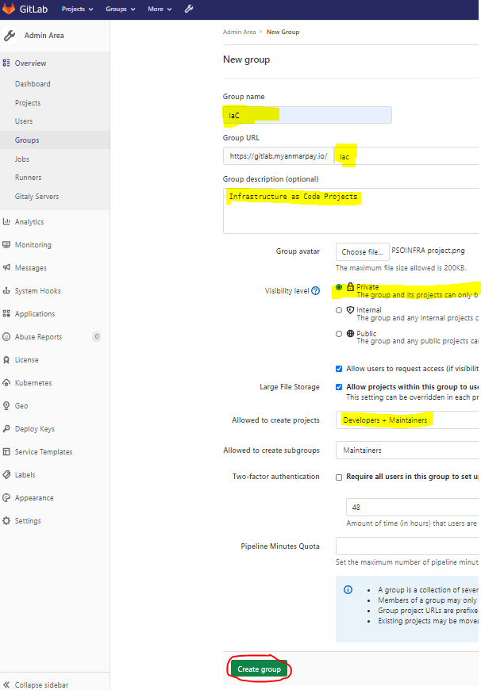
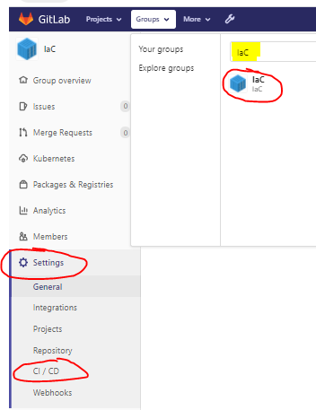
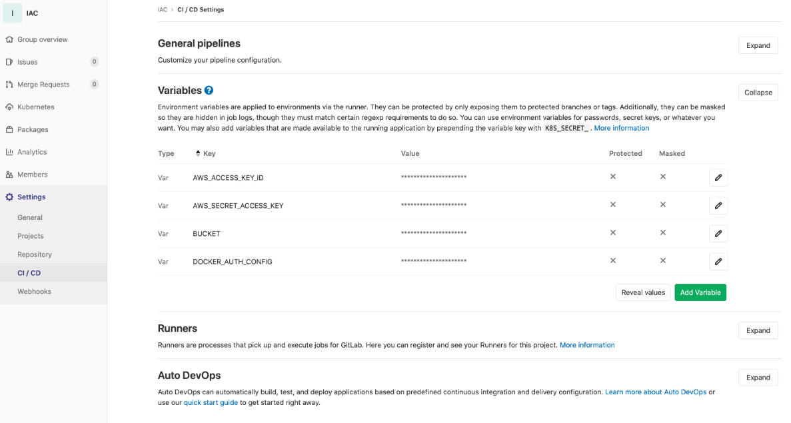

# 15. Setup Gitlab

Browse to the GitLab URL.  This is internet facing and will be a <https://gitlab.domain.tld>. Using the examples/acme/main.tf, this would be <https://gitlab.infra.mojatest.live>

## 1. get root password
```bash
# terraform output gitlab_root_pw
"xxxxxxxxx"
```



The GitLab server can take a significant amount of time to start-up - in some cases more than 10mins.
In some circumstances, the frontend may be responsive, but attempting to change the password may result in:


It is best to wait a while longer before trying to set the root password.  If the situation persists, clear browser history and try again.
If the situation STILL persists, click the "sign up as new user" link, and generate an auto-regstration e-mail.  Then return to the page.  This process will kill any stale identities stored in the browser.

## 2. create first admin user

Once signed in as root, Click the "Admin" button.

Select "Users" from the sidebar, and then "Create User"

Populate the account details for your admin user:

Press the "Create User" button:

> :stop_sign: Do *NOT* attempt to perform further configuration operations as the root use - especially setting up projects - as it will lead to deployment failure.

## 3. login as admin user and create IaC group

From the sidebar, select 'Groups' and press the 'Create Group' button:

Create a group called IaC using the details here:


## 4. Put in group CI/CD variables

Locate the IaC group by

* clicking the "Groups" menu
* entering "IaC" into the search field.
* Click the resulting 'IaC' group.
Select the "Settings" icon from the sidebar, and then select "CICD".


only AWS ACCESS and SECRET KEY are needed for new code

Populate the CICD variables as follows: 

| Variable                    | Description                                                  |
| --------------------------- | ------------------------------------------------------------ |
| ```AWS_ACCESS_KEY_ID```     | Use the “gitlab_ci” user access key ID recorded in the previous step. |
| ```AWS_SECRET_ACCESS_KEY``` | Use the “gitlab_ci” user access key secret recorded in the previous step. |

>For further detail on Nexus connection information, see the [Nexus Deployment Guide](./d30.deploying_nexus.md)

---


---

[Back To List](./d100.building.md)

[NEXT: >>>    (16. Check the CI_Runner)](./d116.ci-runner-check.md)
