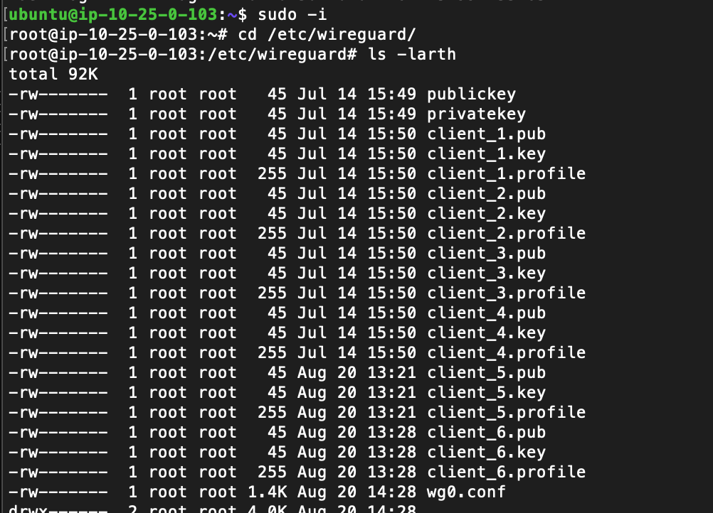
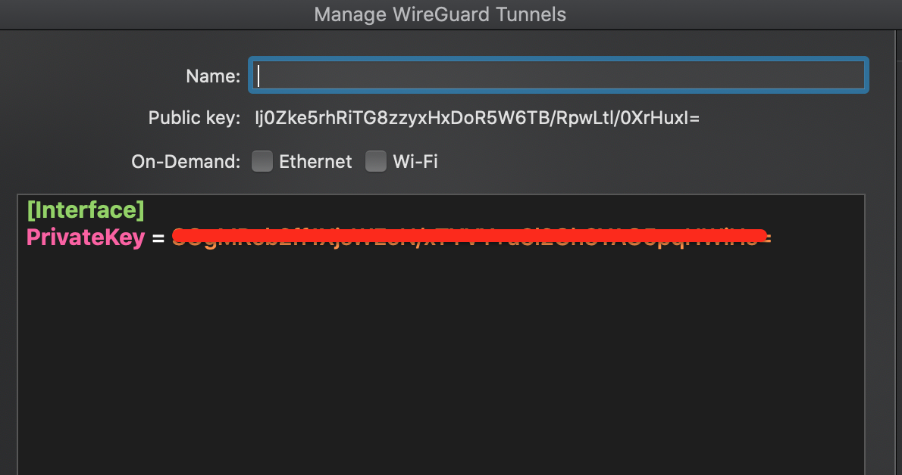
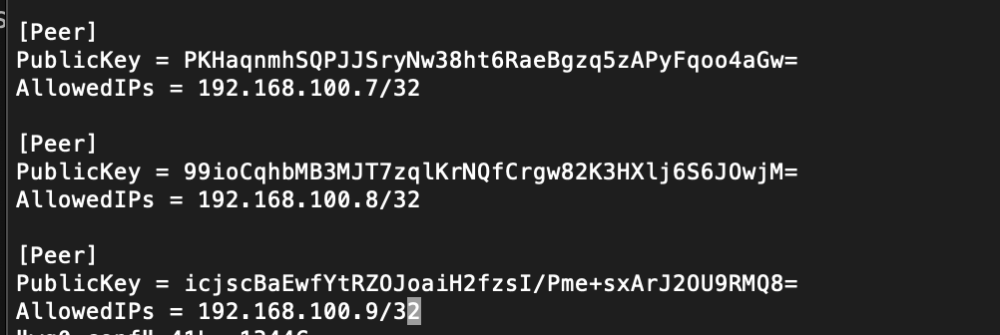
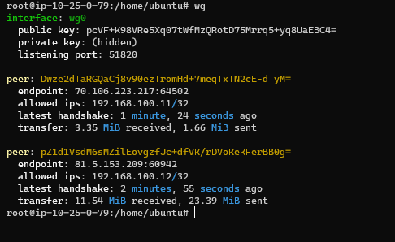
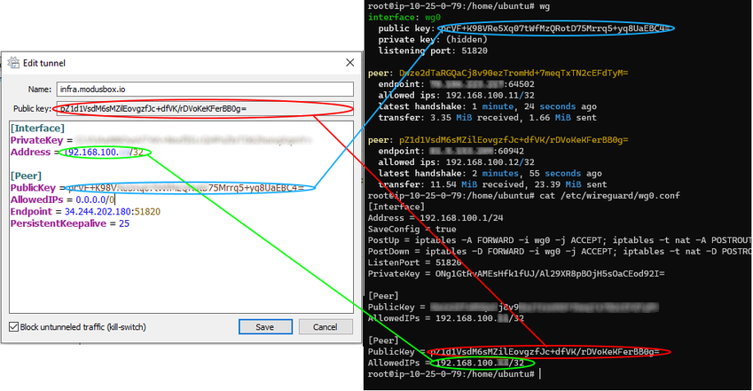

# Adding Accounts to the VPN

This document explains how to use the VPN solution to access Mojaloop environments and how to create profiles and user accounts.

## First Time - establishing the first connection to the Wireguard server

1. Get the bootstrap terraform state file (set `$BUCKET` to the name of your S3 bucket you created previously)

    ``` bash
    aws s3 cp s3://$BUCKET/bootstrap/terraform.tfstate . --sse
    ```

2. Extract the wireguard server ssh key from the state file, save to a file and set the permissions so ssh is happy

    ```bash
    jq '.resources[] | select(.name == "wireguard_provisioner_key") | select(.type == "tls_private_key") .instances[0].attributes.private_key_pem' terraform.tfstate | sed 's/\\n/\'$'\n''/g' > ssh_keys/wireguard
    chmod 0600 ssh_keys/wireguard
    ```

3. Now you can ssh the wireguard server to add profiles (i.e. access accounts) or other admin/ops tasks

    ```bash
    # if you are in the bootstrap dir
    ssh -i ssh_keys/wireguard ubuntu@wireguard.$(terraform output domain)
    # if you are in any other dir, replace `<tenant_domain>` with your actual domain
    ssh -i ssh_keys/wireguard ubuntu@wireguard.<tenant_domain>
    ```

## Managing Wireguard 'Accounts' (connections)

To manage wireguard you need SSH access to the server, follow the ["First Run" section above](#first_time_-_establishing_the_first_connection_to_the_wireguard_server) to get the credentials needed to login.

Login to the wireguard server and open `/etc/wireguard` with sudo user. You will probably find a bunch of files there similar to the screenshot below:



The wireguard server config is stored in the `/etc/wireguard/wg0.conf` file. There you will find the server settings as well as information regarding the authorized peers. Each `[Peer]` entry represents a single user that can access the server. All it takes to register a new Peer is one private IP address that will be used by it upon connection, and the Peer's public key.

To create a VPN connection for a user follow these steps

1. The requester should Add Empty Tunnel from Wireguard application as the following screenshot:
    
2. The requester should provide us with the Public Key and to keep the PrivateKey with themself
    
3. Before doing any change in `wg0.conf`,  the **service must be stopped otherwise the config will be overwritten**

    ```bash
    ubuntu@wireguard:~$ sudo wg-quick down wg0
    ```

    > **IMPORTANT** The wireguard service **must** be stopped before editing.
4. Add the provided publickey under `[peer]` sections to `wg0.conf`, You then assign a single IP address to it (just increment the last one that you see in use)
    

    In this example, the configuration would be:

    ```ini
    [Peer]
    PublicKey = Ij0Zke5rhRiTG8zzyxHxDoR5W6TB/RpwLtl/0XrHuxI=
    AllowedIPs = 192.168.100.10/32
    ```

5. Now start the service again using the following command

    ```bash
    ubuntu@wireguard:~$ sudo wg-quick up wg0
    ```

6. The requester will have provided their private key, and will need to add the public key of the VPN server to their profile (a template is shown further below)
    - The "`wg`" tool can be used to identify the public key of the WireGuard server. This tool is also useful for identifying whether a connection has been successful at a key-exchange level, and confirming that `wg0.conf` `peer-id` matches the clients `public-key`.

    
    - Note: You can also locate the wireguard public key under `/etc/wireguard/publickey`
    

    The requester needs to be provided by the following template to add new profile, which will end up configured to match the server as shown in the picture.

    

    An example client template is provided here:

    ```ini
    [Interface]
    PrivateKey =  // that should be his private key generated by the client
    Address = // that should be the IP address you added to wg0.conf
    DNS = 10.25.0.2

    [Peer]
    PublicKey = // that should be wireguard server public key
    AllowedIPs = 0.0.0.0/0
    Endpoint = wireguard.<tenant_domain>:51820
    PersistentKeepalive = 25
    ```

    - `<tenant_domain>` is the base domain name for the tenant (i.e. the output of `terraform output domain` when run in the `bootstrap` dir)
    - You can use the `wg` tool again to identify the public key of the WireGuard server.  This tool is also useful for identifying whether a connection has been successful at a key-exchange level, and confirming that `wg0.conf` peer-id matches the clients public-key:
    
    - Note: You can also locate the wireguard public key under `/etc/wireguard/publickey`
    

7. Afterwards that the requester should see Status Active for the created tunnel

To test the VPN, ping the default gateway for the VPN server subnet - `ping 10.25.0.1`

---

[Back To List](./d100.building.md)

[NEXT: >>>    (13. Configuraing the GitLab CI-Runner AWS account)](./d113.ci-runner-creds.md)
